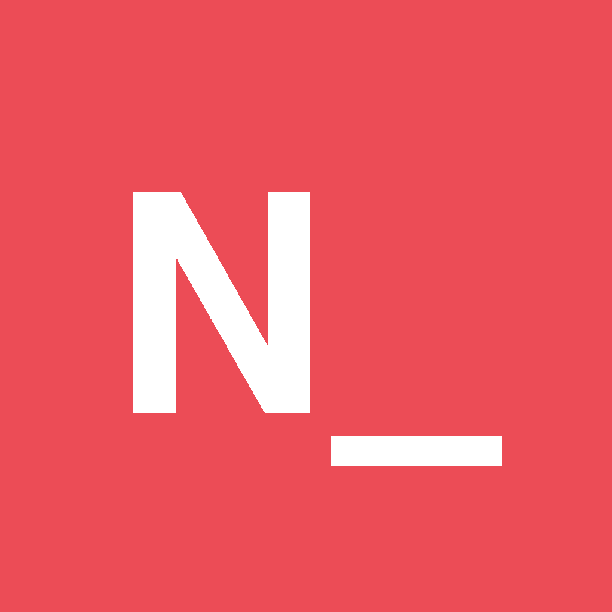
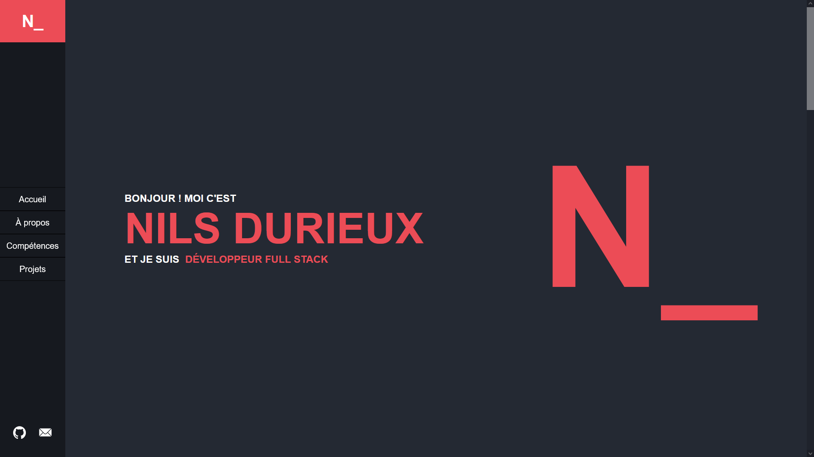

 

  

  <h3 align="center">Nils Durieux's portfolio</h3>

  
The only portfolio you must check out !

## About

This portfolio is made to showcase my skills and some of the projects I've been involved in.

From Java applications to web projects, everything I'm proud of is, and will be displayed here.

It is the first iteration of my portfolio, so expect changes in the coming years !

## Upcoming
The website currently only supports French, with English on the way soon.

## Contact

Nils Durieux - nils.durieux@gmail.com

Project Link : https://github.com/kalutdx/portfolio

## Acknowledgments
* [IUT de Bordeaux](https://www.iut.u-bordeaux.fr/info/)
* [Github logos](https://github.com/logos)
* [Best-README-Template](https://github.com/othneildrew/Best-README-Template/)

(<a href="#readme-top">back to top</a>)
